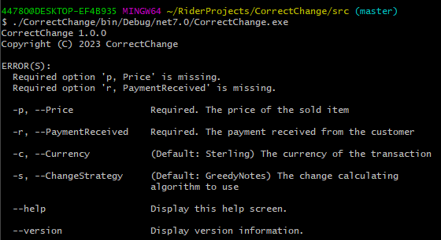

# Correct Change

Develop an application that given a UK Currency amount and the purchase price of a product, displays the change to be returned split down by denomination, largest first.
 
Example:
For a product price of £5.50 and payment received for £20, the application will output:
 
Your change is: (displayed within the console)
1 x £10
2 x £2
1 x 50p

* At least 10x unit tests
* Scalable code (what would happen if the pound change to euro?)

## Implementation

In planning this I paid particular attention to some of the topics we covered in our initial chat, mostly with regard to DI but also fostering an environment in which "a rising tide lifts all boats".

To this end I have done the following:

- dotnet 7, the latest release at time of writing
- Incorporated the default Microsoft DI infrastructure into the Console *(CLI: command-line interface)* project.
- All services, logging and some elements of the *CLI* are registered in the DI containers.
- I have implemented a greedy algorithm for determing change, which ought to work well for rationally designed currencies on the basis of *efficiency*.
  - *Efficiency* here means "least amount of change", i.e fewest notes and coins. For example: 14p change is most efficiently represented as a 10p and two 2ps
  - In some imaginary scenario where UK Sterling has a 7p coin, the efficient choice for 14p would be two 7p coins. The algorithms here will still return a 10p and two 4ps in that circumstance.
  - Also with a view to *efficiency* I've taken the view that the default preference, where denominations are represented as both coins and notes, is to return notes.
  - For the sake of implementing a couple of design patterns (strategies and a very simple factory) I've also implemented the exact same algorithm, but with a preference for coins over notes. This is done via inheritance rather than copy and paste, with a flag to represent which type of denomination to select where two are available.

- The application supports three currencies. They are defined through data, with an enum flag to allow their selection. The currencies are:
  - UK Sterling
  - Euros
  - Chinese Yuan Remnimbi (which has both notes and coins representing a number of denominations) 

- The solution is throughly tested (92% coverage on the domain project):
  - Individual strategies
  - The ChangeCalculatorService, which itself knows nothing about calculating change and devolves all responsibilities to selectable strategies.
  - Some simple architectural tests:
    - Ensuring concrete implementations of interfaces have meaningful names representing their type
	- Ensuring all classes, properties and methods have documentation comments. A bit overkill here but extremely useful in circumstances where published docs are auto-generated from documentation comments. Swagger / OpenAPI, or wikis for published libraries.

**NB** I have a personal preference for Rider over VS, though I have used both for a long time. I've lived with this for a while - it's a mild pain rather than a show stopper - but some of the architectural tests do not work well in either Rider or the Resharper test runner. In the default MS Visual Studio test runner they work just fine, as they do from running ```dotnet test``` against either the solution or test project.

## Running

I have used the "CommandLineParser" nuget package to implement the user interface. A consequence of this is it cannot be executed via ```dotnet run```. The app must be built, and then run via the resulting executable. The reason for this is it has switches to input the parameters (price, payment, etc) which will be interpreted by the shell and passed to ```dotnet run``` instead of the app itself.

The solution is in the *src* directory. Here is a screenshot of running the app from that directory immediately after building. No parameters were supplied.



At present there is no need to specify the verb as there is only one defined. For future expansion, this functionality could be regarded as a *vertical slice* and be left as is. The app could then expand horizontally with other features added as their own *slice*.

The verb is called *change*, and can be accessed specifically as follows:

```
./CorrectChange/bin/Debug/net7.0/CorrectChange.exe change
```

This should produce the same output as shown in the screenshot.

## Example output

### Per the original spec:

```
$ ./CorrectChange/bin/Debug/net7.0/CorrectChange.exe -p 5.50 -r 20
Currency: Sterling

Total change: 14.5

        1 x 10 : Note
        2 x 2 : Coin
        1 x 0.5 : Coin

Verification: 14.5 + 5.50 = 20.00
```

### Same, but in Euros:

```
$ ./CorrectChange/bin/Debug/net7.0/CorrectChange.exe -p 5.50 -r 20 -c Euro
Currency: Euro

Total change: 14.5

        1 x 10 : Note
        2 x 2 : Coin
        1 x 0.5 : Coin

Verification: 14.5 + 5.50 = 20.00
```

### To show the difference:

```
$ ./CorrectChange/bin/Debug/net7.0/CorrectChange.exe -p 10.50 -r 1000
Currency: Sterling

Total change: 989.5

        19 x 50 : Note
        1 x 20 : Note
        1 x 10 : Note
        1 x 5 : Note
        2 x 2 : Coin
        1 x 0.5 : Coin

Verification: 989.5 + 10.50 = 1000.00
```

```
$ ./CorrectChange/bin/Debug/net7.0/CorrectChange.exe -p 10.50 -r 1000 -c Euro
Currency: Euro

Total change: 989.5

        1 x 500 : Note
        2 x 200 : Note
        1 x 50 : Note
        1 x 20 : Note
        1 x 10 : Note
        1 x 5 : Note
        2 x 2 : Coin
        1 x 0.5 : Coin

Verification: 989.5 + 10.50 = 1000.00
```

### Prefer coins or notes

Notes preferred (the default):

```
$ ./CorrectChange/bin/Debug/net7.0/CorrectChange.exe -p 10.50 -r 1000 -c ChinaYuanRenminbi
Currency: ChinaYuanRenminbi

Total change: 989.5

        9 x 100 : Note
        1 x 50 : Note
        1 x 20 : Note
        1 x 10 : Note
        1 x 5 : Note
        2 x 2 : Note
        1 x 0.5 : Note

Verification: 989.5 + 10.50 = 1000.00
```

Same parameters, but with a preference for coins:

```
$ ./CorrectChange/bin/Debug/net7.0/CorrectChange.exe -p 10.50 -r 1000 -c ChinaYuanRenminbi -s GreedyCoins
Currency: ChinaYuanRenminbi

Total change: 989.5

        9 x 100 : Note
        1 x 50 : Note
        1 x 20 : Note
        1 x 10 : Note
        1 x 5 : Note
        2 x 2 : Note
        1 x 0.5 : Coin

Verification: 989.5 + 10.50 = 1000.00
```

